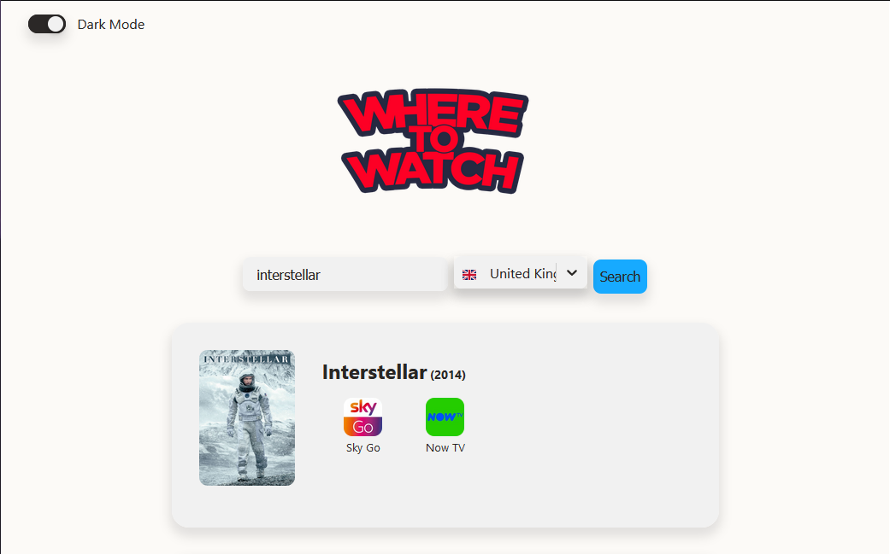
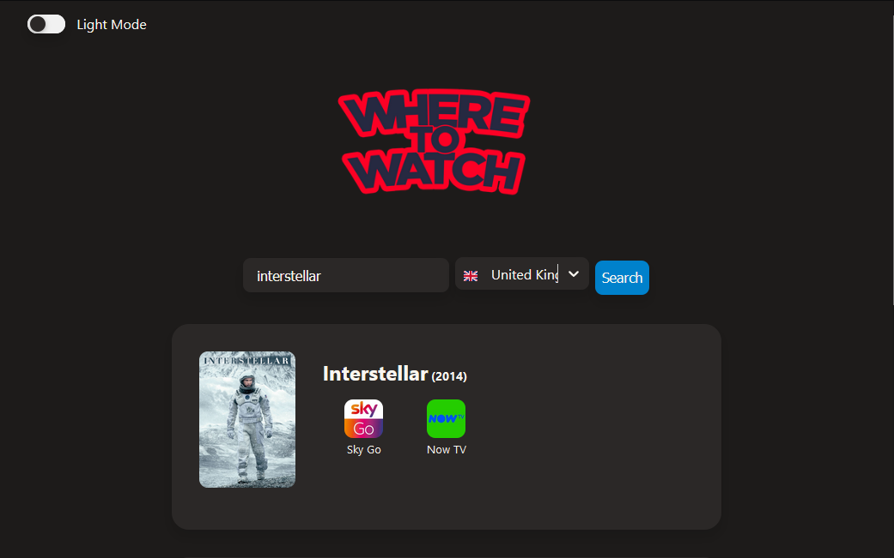

<h1 align="center">  <br>Where To Watch<br></h1>

A web app to find if a movie or show is available in some stream provider in your country.

<br/>


_Light mode_

_Dark mode_
<br/>
<br/>

## Requirements

- [Node.js](https://nodejs.org/en/)

## Installation

### Cloning this repo

```cmd
> git clone https://github.com/pruizlezcano/where-to-watch.git
> cd where-to-watch
```

### Installing dependencies

```cmd
> npm install
```

### Running the app

```cmd
> npm start
```
